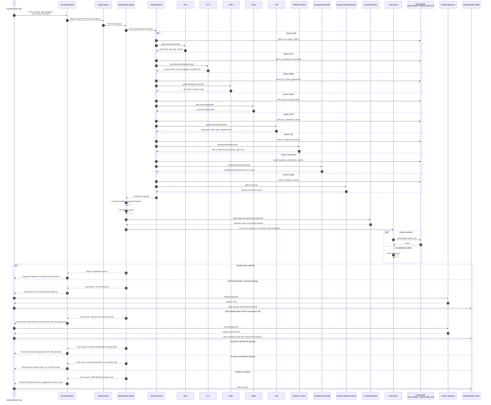
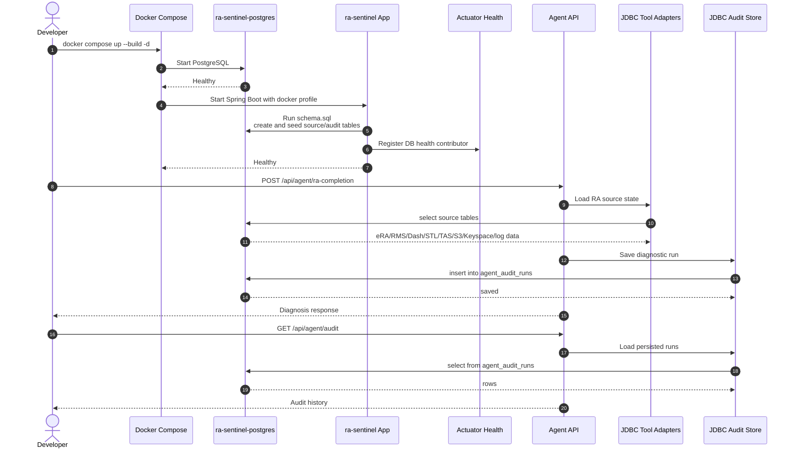

# RA Sentinel Sequence Diagram

This sequence shows how RA Sentinel works around the deterministic legal signing
flow. The agent investigates exceptions, builds evidence, and recommends actions.
It does not alter legal text, charges, signatures, or final agreement state.

## Legal Boundary

The agent is blocked from:

- modifying legal text
- changing charges
- signing for the customer
- submitting a legal agreement autonomously

Any write operation, such as resending a signing link, retrying TAS submission,
retrying PDF archival, or failing over an endpoint, requires human approval.

## Local Production-Like Docker Sequence

This sequence shows the local Docker runtime with PostgreSQL-backed audit
persistence.

